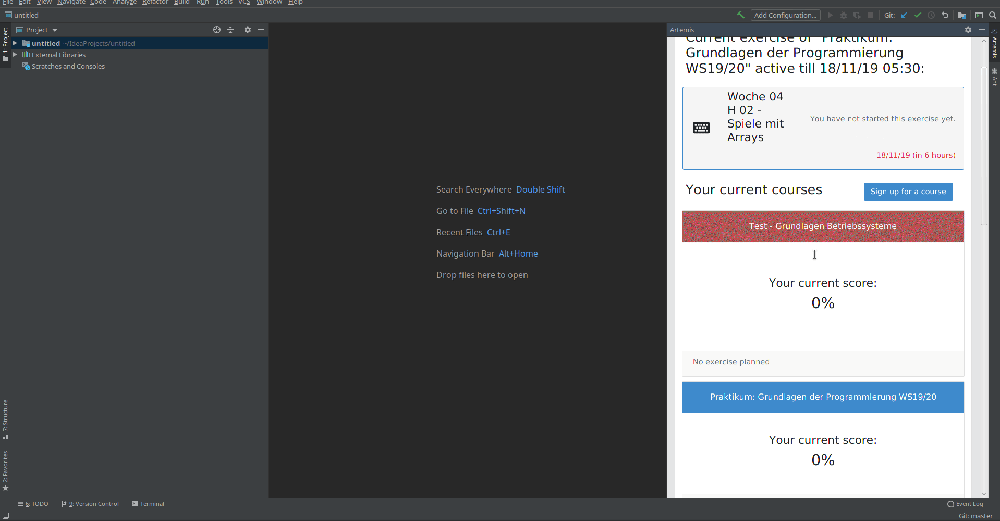
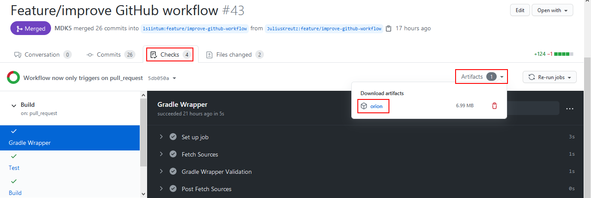
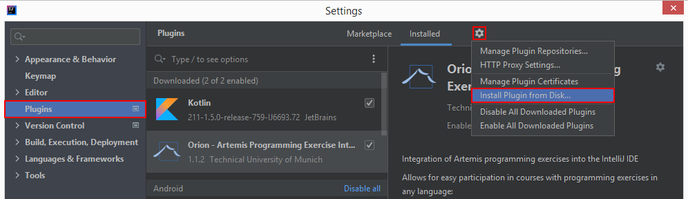
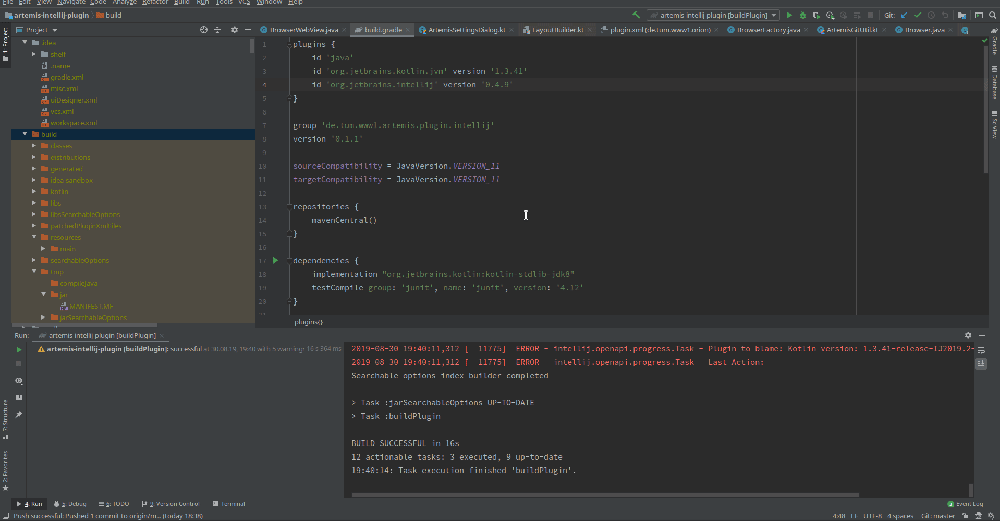

# Orion IntelliJ Plugin

Open Artemis IDE plugin for the programming exercise integration.
This plugin integrates the [Artemis](https://github.com/ls1intum/Artemis) interactive learning platform into the IntelliJ IDE.
It allows you to directly import programming exercises from Artemis and submit your changes to the build servers.

**Current Version:**  

## Example Usage

## Planned Features
We want to integrate the following features into the plugin:

-   Integration of the [JetBrains Edu Tools](https://plugins.jetbrains.com/plugin/10081-edutools)
-   Support for team exercises
-   Automatic conflict resolution

## Development

### Run/Debug the Plugin

- Import as gradle project
- Select the JBR `>11.0.3` as the project SDK with language level 11
- Run Gradle task: `runIde`. This will open a new IntelliJ window with the plugin installed.

### Perform Version Upgrade

Upon release of a new mayor IntelliJ version, the plugin needs to be upgraded to support the new version. This upgrade can oftentimes also be performed without deeper knowledge of the codebase. In the following, the necessary steps are outlined:
1. If you do not have read access to the GitHub repository, fork the repository and clone it
2. Make sure you are able to run the plugin locally as described above
3. Adapt the versions in the build configuration file [build.gradle.kts](https://github.com/ls1intum/Orion/blob/master/build.gradle.kts)
    1. At "plugins" and "dependencies", look up the latest version numbers 
  
### Testing of Pull Requests

1.  #### Download Release (.zip)
    
    Download the release file from the pull request's _Checks_ &rarr; _Artifacts_ &rarr; _orion_
    
    The artifact is unavailable during building. The full history of artifacts can be retrieved though the _Actions_ tab

2.  #### Install Release (.zip)
   
    Install the release file in IntelliJ at _Settings_ &rarr; _Plugins_ &rarr; _Settings_ &rarr; _Install Plugin from Disk..._ &rarr; Select the file
  
    

    
Installation process as gif

   
    
    

## Feedback? Questions?
Email: alexander(dot)ungar(at)tum(dot)de
