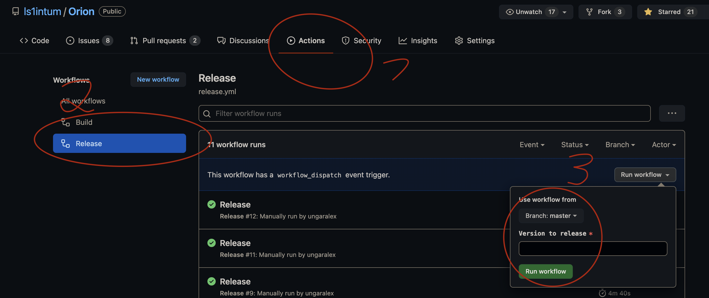
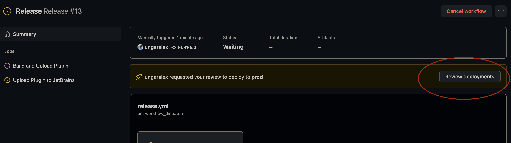
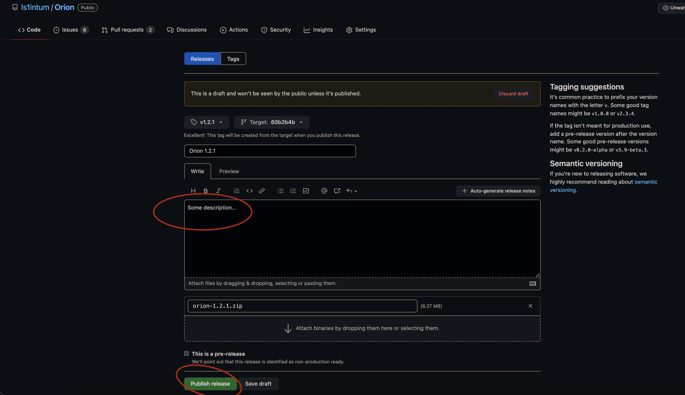

# Orion IntelliJ Plugin

Open Artemis IDE plugin for the programming exercise integration.
This plugin integrates the [Artemis](https://github.com/ls1intum/Artemis) interactive learning platform into the IntelliJ IDE.
It allows you to directly import programming exercises from Artemis and submit your changes to the build servers.

Detailed documentation is integrated into [Artemis' documentation](https://artemis-platform.readthedocs.io/en/latest/user/orion/).

**Current Version:**  

## Example Usage

## Manual Installation

Download the release from [here](https://github.com/ls1intum/Orion/releases) and install it as described [further down in this document](https://github.com/ls1intum/Orion#install-release-zip).

## Planned Features
We want to integrate the following features into the plugin:

-   Integration of the [JetBrains Edu Tools](https://plugins.jetbrains.com/plugin/10081-edutools)
-   Support for team exercises
-   Automatic conflict resolution

## Development

### Run/Debug the Plugin

- Import as gradle project
- Select the JBR `>11.0.3` as the project SDK with language level 11
- Run Gradle task: `runIde`. This will open a new IntelliJ window with the plugin installed.

### Perform Version Upgrade

Upon release of a new mayor IntelliJ version, the plugin needs to be upgraded to support the new version. This upgrade can oftentimes also be performed without much knowledge of the codebase. In the following, the necessary steps are outlined:
1. If you do not have write access to the GitHub repository, fork the repository and clone it
2. Make sure you are able to run the plugin locally as described above
3. Adapt the versions in the build configuration file [build.gradle.kts](https://github.com/ls1intum/Orion/blob/main/build.gradle.kts)
    1. At `intellij`, change the version property to the latest version. This is the IntelliJ version used for "runIde". Also adapt the version numbers of all versioned plugins at `intellij`→`plugins`. You can look up each plugin in the IntelliJ marketplace and find the latest compatible version there.
    2. At `tasks`→`patchPluginXml`, change the `sinceBuild` and `untilBuild` property accordingly, the format is explained in a comment there.
    3. Optionally upgrade the versions of the dependencies at `plugins` and `dependencies`, however this is usually not necessary.
4. Run the project locally with runIde or buildPlugin. If compilation errors happen, try to resolve them; on version changes, IntelliJ sometimes deprecates APIs or moves packages. Fixing these errors requires looking into and changing the code. A very helpful resource is the [documentation of the IntelliJ Platform SDK](https://plugins.jetbrains.com/docs/intellij/welcome.html).
5. When the plugin runs locally, create a pull request with your changes. Also consider notifying a maintainer of Orion or Artemis to make sure your pull request gets noticed.
  
### Testing of Pull Requests

1.  #### Download Release (.zip)
    
    Download the release file from the pull request's _Checks_ &rarr; _Artifacts_ &rarr; _orion_
    
    The artifact is unavailable during building. The full history of artifacts can be retrieved though the _Actions_ tab

2.  #### Install Release (.zip)
   
    Install the release file in IntelliJ at _Settings_ &rarr; _Plugins_ &rarr; _Settings_ &rarr; _Install Plugin from Disk..._ &rarr; Select the file
  
    

    
Installation process as gif

   
    
    

## Publish a new Release

**Before you release any new version, make sure that all version properties in the repository are updated
(`version` in `build.gradle.kts`) and the changelog contains the relevant version information (also in `build.gradle.kts`)**

Follow the steps outlined here:

1. Go to the GitHub "_Actions_" tab on the Orion repository
2. Select the "_Release_" workflow
3. Click on "_Run workflow_" and input the new version number to release (e.g. `1.5.0` releases and tags version `v1.5.0`)
4. An admin now has to review and accept the new release by viewing the created workflow run

5. After the release is approved, GitHub will automatically build and upload the artifact. It will also create a new draft GitHub release
6. An admin needs to promote the GitHub draft release in order to properly tag and release the latest build on GitHub.
    1. Go to the releases page and open the generated latest draft release of Orion
    2. Update the changelog by copy-pasting the information into the description box
    3. Click on 'Publish release' to finish the process

The latest plugin artifact is now available on both GitHub and via the JetBrains marketplace. 

**It might take some time for the latest version to be seen on the marketplace since JetBrains still has to review 
and approve the changes!**

### Release Process Implementation

**How can I modify the pipeline?**

The release pipeline is fully implemented using GitHub actions. In order to change anything about the process you just
have to edit the `release.yml` in the `.github/workflows` directory.

**Where can I find secrets like the authentication token for the JetBrains repository?**

Admins of the GitHub repository can modify the build environment under  _Settings -> Environments -> prod_. This includes
adding and updating any secrets that should get injected into the environment during the build process.

## Feedback? Questions?
Email: alexander(dot)ungar(at)tum(dot)de
