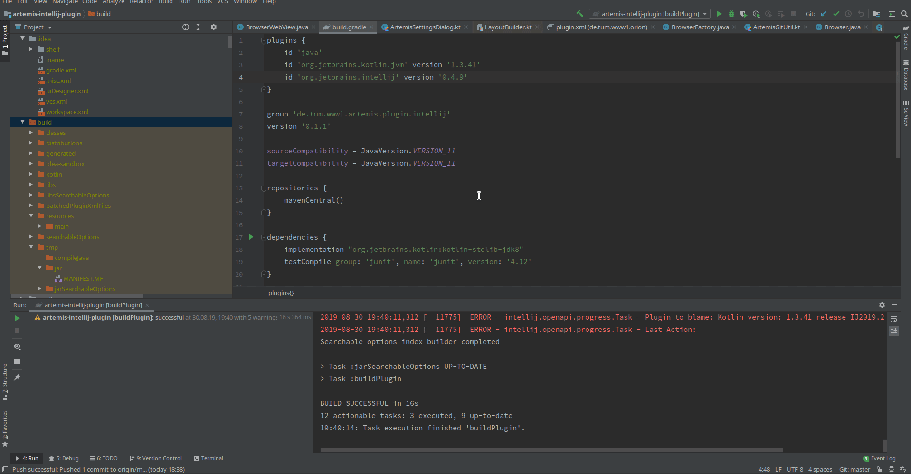

# Orion IntelliJ plugin

**O**pen A**r**TEMiS **I**DE plugin for the pr**O**gramming exercise i**N**tegration.
This plugin integrates the [ArTEMiS](https://github.com/ls1intum/Artemis) interactive learning platform into the IntelliJ IDE.
It allows you to directly import programming exercises from ArTEMiS and submit your changes to the build servers.

**Current version:** 0.2.3

## Planned features
We want to integrate the following features into the plugin:

 - Automated exercise project import
 - Automated code submission (`git pull` + `git stage` + `git commit` + `git push`)
 - Java/JS bridge communication between the plugin and the ArTEMiS Angular web application
 - Display of test results and submission feedback
 - Integration of the  [JetBrains Edu Tools](https://plugins.jetbrains.com/plugin/10081-edutools)

## Run/debug the plugin

 - Select the JBR `>11.0.3` as the project SDK with language level 11
 - Run Gradle task: `runIde`

## Installation of a release (.zip)

## Example Usage

## Feedback? Questions?
Email: alexander.ungar(at)tum.de

